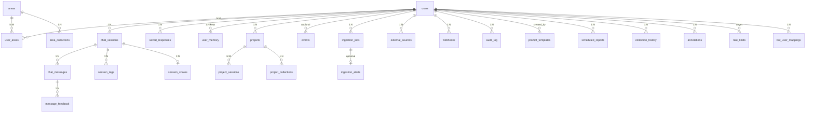

# `@rag-saldivia/db`

Capa de persistencia: **Drizzle ORM** sobre **SQLite** (`@libsql/client`) más **Redis** (ioredis) para secuencias, blacklist JWT, cachés y contadores.

## Tablas (esquema)

El archivo fuente es `src/schema.ts`. Hay **26 tablas** SQLite, entre ellas: usuarios, áreas, sesiones y mensajes de chat, proyectos, ingesta, eventos (black box), memoria por usuario, shares, plantillas, webhooks, etc.

## Diagrama ER (Mermaid)

> En GitHub el bloque `mermaid` se renderiza en la vista del archivo.



Tablas sin FK fuerte al grafo anterior (o usadas transversalmente): `rate_limits`, `events`, `ingestion_alerts`, `audit_log`, etc.

## Cómo agregar una tabla

1. Definir `sqliteTable` en `src/schema.ts` y relaciones si aplica.
2. Añadir funciones en `src/queries/<dominio>.ts`.
3. Tests en `src/__tests__/<dominio>.test.ts`.
4. Aplicar schema (`drizzle-kit push` o migraciones según el flujo del repo).

## Queries por archivo

| Archivo | Funciones (resumen) |
|---------|----------------------|
| `users.ts` | `getUserById`, `listUsers`, `verifyPassword`, `createUser`, `updateUser`, `deleteUser`, `getUserCollections`, `canAccessCollection`, … |
| `areas.ts` | `listAreas`, `createArea`, `updateArea`, `deleteArea`, `setAreaCollections`, … |
| `sessions.ts` | `listSessionsByUser`, `getSessionById`, `createSession`, `addMessage`, `addFeedback`, … |
| `tags.ts` | `addTag`, `removeTag`, `listTagsBySession`, … |
| `memory.ts` | `setMemory`, `getMemory`, `deleteMemory`, `getMemoryAsContext` |
| `projects.ts` | `createProject`, `listProjects`, `addSessionToProject`, … |
| `events.ts` | `writeEvent`, `queryEvents`, `getEventsForReplay` |
| `events-cleanup.ts` | `deleteOldEvents` (retención vía `LOG_RETENTION_DAYS`) |
| `search.ts` | `universalSearch` |
| `shares.ts` | `createShare`, `getShareByToken`, `revokeShare`, … |
| `templates.ts` | `listActiveTemplates`, `createTemplate`, `deleteTemplate` |
| `saved.ts` | `saveResponse`, `listSavedResponses`, … |
| `annotations.ts` | `saveAnnotation`, `listAnnotationsBySession`, … |
| `collection-history.ts` | `recordIngestionEvent`, `listHistoryByCollection` |
| `reports.ts` | CRUD de informes programados |
| `webhooks.ts` | CRUD de webhooks |
| `rate-limits.ts` | límites por usuario |
| `external-sources.ts` | fuentes externas (Drive, etc.) |

## Redis en este paquete

| Uso | Detalle |
|-----|---------|
| Blacklist JWT | `revoked:{jti}` (TTL alineado al JWT) |
| Secuencia de eventos | `INCR events:seq` |
| Tamaños de log | Hash `log:sizes` (rotación de archivos) |
| Caché de colecciones (consumida desde web) | Clave `rag:collections` — invalidación en rutas RAG |

Ver `src/redis.ts` y ADR-010.

## Tests

```bash
bun test packages/db/
```

Desde la raíz del monorepo también: `bun run test` incluye `@rag-saldivia/db`.
